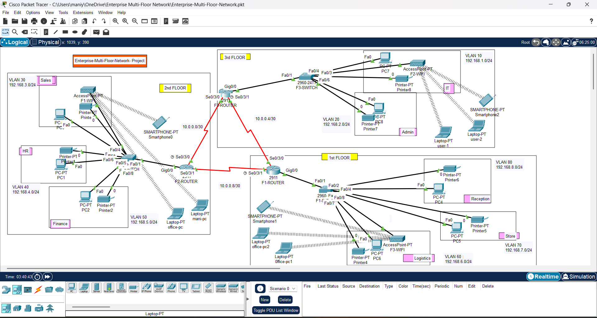

# Enterprise Multi-Floor Network Design & Implementation

## 📌 Project Overview

This project demonstrates the design and implementation of a **multi-floor enterprise network** using **Cisco Packet Tracer**.

The network is designed to provide separate network segments for different departments while enabling controlled communication between VLANs through routing.

## 🏢 Network Architecture

The enterprise network consists of **three floors**:

- **1st Floor** – Reception, Store, Logistics
- **2nd Floor** – Sales, HR, Finance
- **3rd Floor** – IT, Admin

---
## 🖼️ Network Topology



---

## 🏷️ VLAN & Department Details
| VLAN | Department | Network | Default Gateway |
|------|------------|---------|-----------------|
| 10 | IT | 192.168.1.0/24 | 192.168.1.1 |
| 20 | Admin | 192.168.2.0/24 | 192.168.2.1 |
| 30 | Sales | 192.168.3.0/24 | 192.168.3.1 |
| 40 | HR | 192.168.4.0/24 | 192.168.4.1 |
| 50 | Finance | 192.168.5.0/24 | 192.168.5.1 |
| 60 | Logistics | 192.168.6.0/24 | 192.168.6.1 |
| 70 | Store | 192.168.7.0/24 | 192.168.7.1 |
| 80 | Reception | 192.168.8.0/24 | 192.168.8.1 |

## 🌐 Router-to-Router Networks

Point-to-point connections between routers use `/30` networks.

| Network | Purpose |
|---------|---------|
| 10.0.0.0/30 | Router-to-Router Link |
| 10.0.0.4/30 | Router-to-Router Link |
| 10.0.0.8/30 | Router-to-Router Link |


----

## 🔀 VLAN Segmentation

Separate VLANs were created for each department.

This provides:

- Department-level network segmentation
- Reduced broadcast domains
- Better network organization
- Improved security
- Easier troubleshooting
- Scalable network design

---

## 🚦 Inter-VLAN Routing

Router-on-a-stick configuration is used to provide communication between VLANs.

Example subinterfaces:

```text
GigabitEthernet0/0.10
GigabitEthernet0/0.20
GigabitEthernet0/0.30
GigabitEthernet0/0.40
GigabitEthernet0/0.50
GigabitEthernet0/0.60
GigabitEthernet0/0.70
GigabitEthernet0/0.80


Example configuration:

interface GigabitEthernet0/0.10
 encapsulation dot1Q 10
 ip address 192.168.1.1 255.255.255.0

interface GigabitEthernet0/0.20
 encapsulation dot1Q 20
 ip address 192.168.2.1 255.255.255.0


🧭 Dynamic Routing – OSPF

OSPF (Open Shortest Path First) is configured for dynamic routing between the routers.

Example:

## ⚙️ Technologies & Concepts

- **VLAN**
- **Inter-VLAN Routing**
- **OSPF**
- **DHCP**
- **IP Addressing**
- **Subnetting**
- **Trunking**
- **Access Ports**
- **Wireless Networking**
- **Cisco IOS**
- **Network Troubleshooting**


## 🖥️ Network Devices

- Cisco Routers
- Cisco 2960 Switches
- PCs
- Laptops
- Printers
- Wireless Access Points
- Smartphones

## 📡 Wireless Networking

Wireless access points provide connectivity for:

- Laptops
- Smartphones
- Other wireless devices

## 🔧 Configuration Files

All major device configurations are available in the `configurations` folder.

### Routers

- `R1.txt`
- `R2.txt`
- `R3.txt`

### Switches

- `F1-SWITCH.txt`
- `F2-SWITCH.txt`
- `F3-SWITCH.txt`

## 🧪 Network Verification

The following Cisco IOS commands were used for verification and troubleshooting:

```test
show ip interface brief
show ip route
show vlan brief
show interfaces trunk
show running-config
ping
traceroute


Enterprise-Multi-Floor-Network/
│
├── Enterprise-Multi-Floor-Network.pkt
├── topology.png
├── README.md
│
└── configurations/
    ├── R1.txt
    ├── R2.txt
    ├── R3.txt
    ├── F1-SWITCH.txt
    ├── F2-SWITCH.txt
    └── F3-SWITCH.txt


🎯 Project Objective

The objective of this project is to demonstrate practical knowledge of enterprise network design, VLAN segmentation, IP addressing, routing, DHCP, wireless networking, and network troubleshooting using Cisco Packet Tracer.

💼 Skills Demonstrated

Network Design • VLAN • Routing • OSPF • DHCP • Switching • IP Addressing • Subnetting • Wireless Networking • Cisco IOS • Troubleshooting
